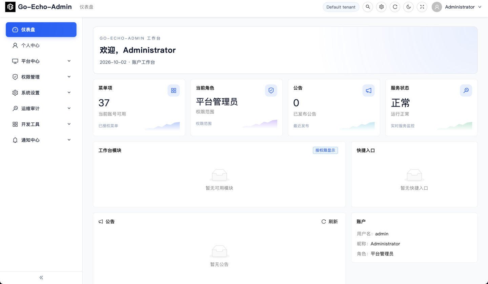
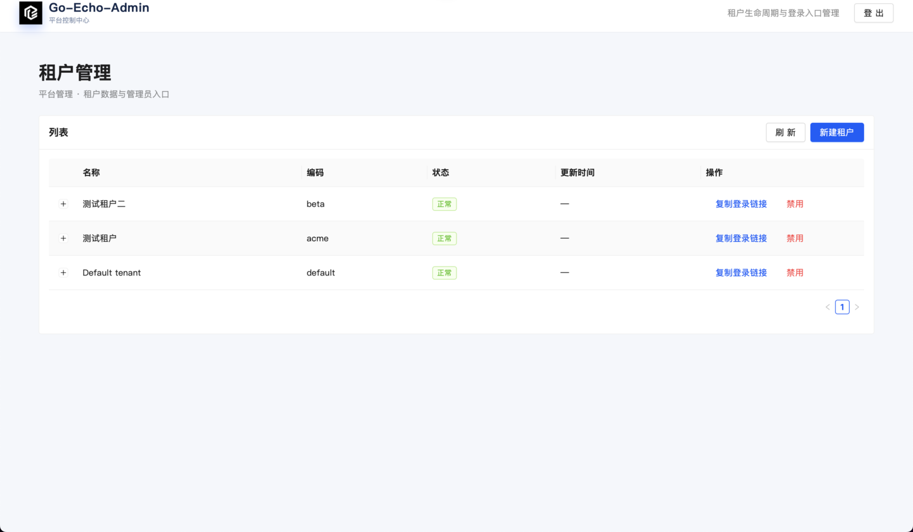
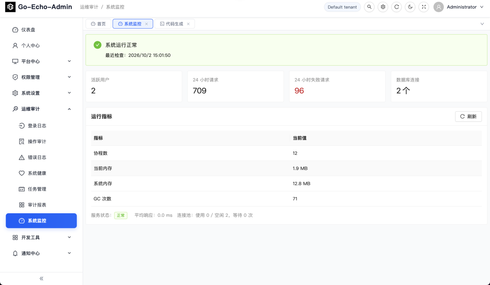
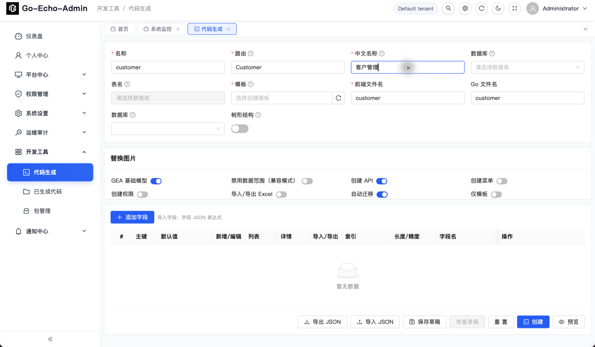

# Go Echo Admin

面向生产项目的 Echo v5 后台管理脚手架，提供认证、RBAC、多租户上下文、审计、文件中心、开发工具、运维基础和 React 管理端的可扩展基础。项目持续完善基础管理、业务工具和生产化能力，完整边界以 [产品需求文档](docs/echo-admin-prd.md) 为准。

## 项目命名

| 用途 | 名称 |
| --- | --- |
| 项目名称 | Go Echo Admin |
| GitHub 仓库 | `puppyhe/go-echo-admin` |
| Go module | `github.com/puppyhe/go-echo-admin` |
| 管理命令 | `echo-admin`（源码入口 `cmd/echo-admin`） |
| 环境变量前缀 | `ECHO_ADMIN_` |

仓库名中的 `go` 标明技术栈，命令名保持简短。Go 包按职责命名，如 `app`、`database`、`storage`、`tenant`，导入路径统一使用上述 module 前缀。

## 界面预览

以下截图来自本地演示环境，页面数据仅用于展示项目能力。

| 品牌登录 | 首页工作台 |
| --- | --- |
|  |  |

| 平台租户管理 | 系统监控 |
| --- | --- |
|  |  |

| 代码生成 |
| --- |
|  |

## 能力边界

- Echo v5 + Go 1.25，Handler 返回 `error`，统一绑定、验证和 HTTP 错误响应。
- MySQL 8.4 默认数据库，Redis 为可选缓存/会话依赖；GORM 模型由统一迁移服务管理。
- Access/Refresh Token、RBAC API 权限和共享数据库/共享表多租户上下文。
- 账户与安全管理：个人中心与改密、安全策略、服务器状态、错误日志、API Token（哈希存储、作废和 Bearer 鉴权）。
- 文件与通知能力：租户隔离文件中心、可替换存储适配器、通知收件箱/渠道/模板，以及安全预览式代码生成器。
- 任务与生产化能力：进程内/数据库持久任务队列、真实定时任务执行器、S3/MinIO 对象存储、分片续传、组织关系与细粒度权限矩阵、审计报表和系统监控。
- 默认种子菜单已接入个人中心、文件中心、代码生成、通知中心、任务管理、权限管理和运维入口；每个入口都有对应的后端能力或明确的安全预览边界。
- `echo-admin init/migrate/seed` CLI，与 HTTP 服务共用应用服务和配置校验。
- React + TypeScript 管理端位于 `web/`；后端 API 可独立接入其他客户端。
- Docker Compose、本地单二进制、非 root 容器、备份/升级 CLI 和生产部署路径。

## 快速开始（开发环境）

要求：Go 1.25+、Docker Compose、Node.js 22.15+（仅开发前端）。

```sh
git clone https://github.com/puppyhe/go-echo-admin.git
cd go-echo-admin

go run ./cmd/echo-admin init       # 生成被 .gitignore 忽略的本地 .env
docker compose up -d mysql redis
go run ./cmd/echo-admin migrate
ECHO_ADMIN_ADMIN_PASSWORD=change-me-now go run ./cmd/echo-admin seed
go run ./cmd/server
```

服务默认监听 `http://127.0.0.1:8080`。执行完整容器栈 `docker compose up -d` 时，参考前端位于 `http://127.0.0.1:8081`，它会通过 Nginx 代理 API。健康检查：`GET /health/live`（进程存活）与 `GET /health/ready`（数据库等依赖就绪）。管理员密码通过 ECHO_ADMIN_ADMIN_PASSWORD 或 seed 的 --password 注入，不在仓库内写死；生产环境请使用一次性秘密。示例密码仅用于本地，请立即替换；生产通过秘密管理系统注入 `ECHO_ADMIN_ADMIN_PASSWORD`。开发环境如需前端：

```sh
cd web
npm ci
npm run dev
```

### 登录与创建租户

项目采用“平台管理员 → 租户管理员”的登录链路，避免平台账号直接混入业务租户：

1. 打开前端的 `/platform/login`，使用 `seed` 初始化的 `admin` 平台账号登录。
2. 在“平台中心 → 租户管理”创建租户，填写租户名称、租户编码和至少 12 位的管理员初始密码。系统会为该租户创建独立的 `admin` 成员凭据。
3. 进入 `/login?tenant=<租户编码>`，使用租户编码、`admin` 和创建租户时设置的初始密码登录业务管理台。

平台管理员负责租户的创建、启用、停用和重试；租户管理员只访问当前租户的数据。API 细节和 curl 示例见 [API 合约](docs/api.md)。

### 账户与安全管理

登录后，平台管理员可以在“个人中心”修改资料和租户密码，在“系统设置 → 安全配置”维护当前租户的安全策略，在“运维审计 → 系统健康/错误日志”查看运行状态与处理失败请求，并在“权限管理 → API 令牌”签发或作废自动化访问令牌。API 令牌只在签发响应中返回一次明文，数据库只保存哈希；调用接口时使用 `Authorization: Bearer gea_...`，令牌会重新经过租户成员、角色和租户状态校验。

前端开发服务器会将 `/api/v1` 请求代理至 `http://127.0.0.1:8080`。生产部署可先 `npm run build`，再通过 Nginx 或其他静态文件服务器发布 `web/dist`。

### 文件中心

“系统设置 → 文件中心”提供文件上传、搜索、下载和删除。上传文件的元数据保存在当前租户范围内，文件内容写入 `ECHO_ADMIN_STORAGE_PATH` 下的随机存储键，数据库只记录 SHA-256、MIME、大小和存储键，不使用用户输入直接拼接磁盘路径。所有 `/uploads/<租户编码>/<随机文件名>` 下载地址都要求当前登录会话，并校验租户编码与服务端身份一致。

> `docker compose up -d mysql redis` 只启动依赖，适合在主机上调试后端；直接执行 `docker compose up -d` 会构建并启动 `backend` 与 `web` 容器。Compose 不会自动创建管理员，首次创建新数据卷时 MySQL 可能需要几十秒才就绪；应用应在 `ready` 检查通过后再启动。

### 开发工具与运维

默认种子会添加“运维审计 → 任务管理”“通知中心”和“开发工具”。任务模块保存租户级定义、配置和运行记录；通知模块提供收件箱、模板预览、渠道和投递重试基础；“开发工具 → 代码生成”可读取数据库表结构，生成确定性的 CRUD 文件预览、差异哈希和历史记录。生成命令默认只写入记录或下载模板 ZIP，不覆盖工作区文件。

### 任务执行与生产化能力

“运维审计 → 任务管理”现在由调度扫描器和 worker 执行：内置心跳/通知任务可以直接执行，HTTP 任务必须经过租户级允许主机校验、超时和禁止重定向策略。`ECHO_ADMIN_QUEUE_DRIVER=database` 时，任务使用数据库中的 queued/leased 运行记录作为持久队列，进程重启后不会丢失待执行任务；`memory` 适合本地开发。

文件中心支持本地磁盘和 S3 兼容存储（AWS S3、MinIO、Ceph RGW），并提供分片初始化、分片状态、校验合并、断点续传和取消接口。分片临时对象与最终文件都使用租户范围的随机存储键。

权限管理新增组织关系、岗位成员、权限矩阵和资源动作授权；运维审计新增按时间、用户、资源和动作聚合的报表，系统监控展示数据库连接池、进程内存、协程和租户级错误/审计事件。生产部署与升级步骤见 [生产部署与升级](docs/deployment.md)。

## 常用命令

```sh
make init          # 生成本地 .env
make docker-up    # 启动依赖
make migrate      # 执行迁移
make seed ADMIN_PASSWORD=change-me-now  # 加载开发种子
make dev          # 启动后端
make test         # Go 测试
make lint         # go vet
make build        # 构建 bin/echo-admin
```

CLI 对应命令也可以直接使用：`go run ./cmd/echo-admin init|migrate|seed|gen|plugin`。生产环境应在发布流程中显式执行迁移和安全初始化；不要在生产使用开发种子或提交 `.env`。

## 配置

配置优先级是：默认值 < `.env` 文件 < 环境变量 < 命令行参数。环境变量前缀为 `ECHO_ADMIN_`，键名使用大写下划线。`APP_ENV` 只能为 `development` 或 `production`。初始化后查看 `.env` 中的注释与当前配置项，字段说明见 [配置文档](docs/configuration.md)。敏感值不会写入启动日志；生产至少需要随机的 JWT 密钥、数据库凭据和受限的 CORS 来源。

## 项目结构

```text
cmd/server/             Echo 服务入口
cmd/echo-admin/         Cobra CLI
internal/app/           配置与生命周期
internal/module/        业务模块
internal/platform/      数据库、缓存、认证和存储适配
web/                    React + TypeScript 管理端
docs/                   PRD、配置和架构文档
migrations/             迁移说明
```

模块通过注册协议接入路由、迁移、权限资源、菜单、种子、健康检查和 CLI 子命令；业务 Handler 不应直接读取 Viper 或绕过租户 Scope。跨租户平台操作必须使用显式平台权限并写入审计。

## 验证与安全

提交前执行：

```sh
gofmt -w $(find . -name '*.go' -not -path './vendor/*')
go vet ./...
go test ./...
npm --prefix web ci
npm --prefix web run build
```

生产部署必须关闭开发工具和演示种子，使用 TLS/反向代理限制 CORS，配置 Token 轮换、限流、审计保留和备份策略。不要把密码、Token、数据库连接串或生产日志提交到仓库。多租户资源缺少认证上下文时默认拒绝；伪造 `tenant_id` 请求头不会改变服务端租户范围。

## 文档与贡献

- [产品需求文档](docs/echo-admin-prd.md)
- [架构概览](docs/architecture/overview.md)
- [数据库迁移说明](migrations/README.md)
- [配置参考](docs/configuration.md)
- [贡献指南](CONTRIBUTING.md)

欢迎提交 Issue 和 Pull Request。请先阅读贡献指南以及 PRD 的验收标准。

## License

本项目采用 MIT License，详见 [LICENSE](LICENSE)。
